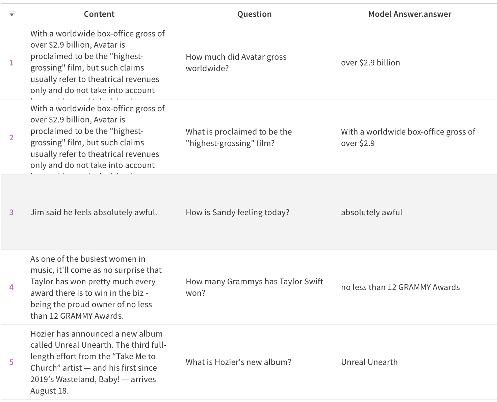

# Transfer Learning with DistilBert for Sentiment140

## Link

WandB: https://wandb.ai/arth-shukla/SQuAD2.0%20with%20Fine-Tuned%20DistilBERT

## Resources Used

I used the Stanford SQuAD 2.0 Question-Answer Database: https://rajpurkar.github.io/SQuAD-explorer/

## Technologies Used

Algorithms/Concepts: Transformers, Transfer Learning, BERT/DistilBERT, Question-Answer

AI Development: Pytorch (Torch, Datasets, Dataloaders, Cuda), HuggingFace Transformers Library, DistilBERT

## Evaluation and Inference

Full Table and other runtime info available on WandB: https://wandb.ai/arth-shukla/SQuAD2.0%20with%20Fine-Tuned%20DistilBERT

    

## Future Experiments

I want to try doing something similar to my BERT Sentiment Analysis project (https://github.com/arth-shukla/sentiment140-bert-transfer-learning). In that project, I retrained my original model on the failure cases by choosing all examples over a certain loss. I think doing that here will improve the model as well.

## About Me

Arth Shukla [Site](https://arth.website) | [GitHub](https://github.com/arth-shukla) | [LinkedIn](https://www.linkedin.com/in/arth-shukla/)
